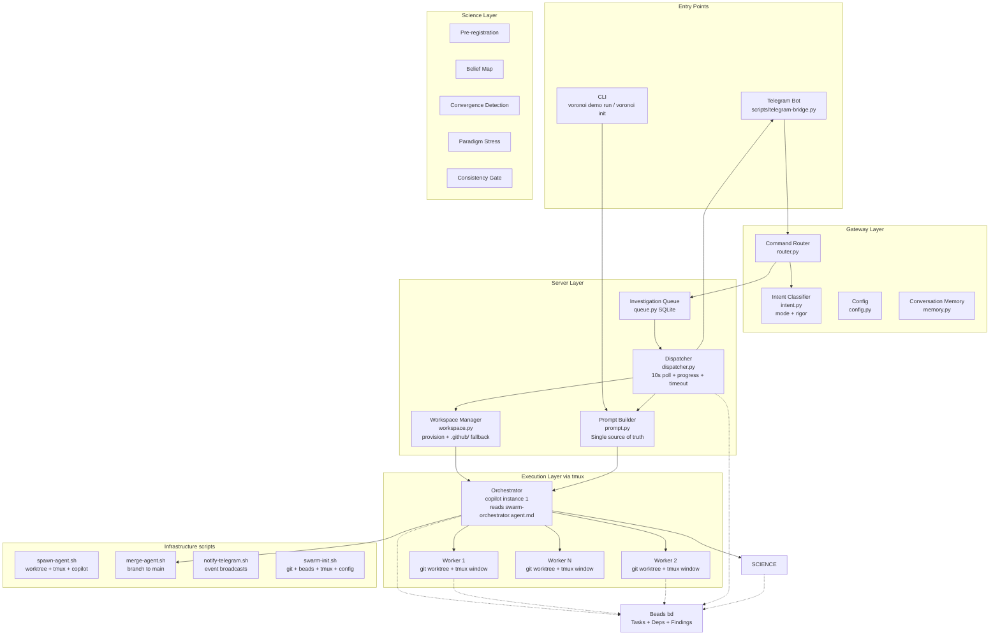
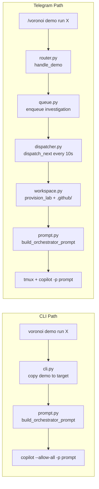
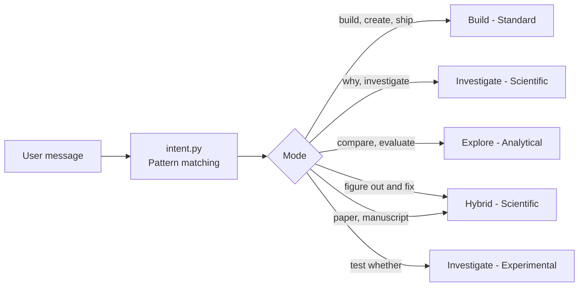
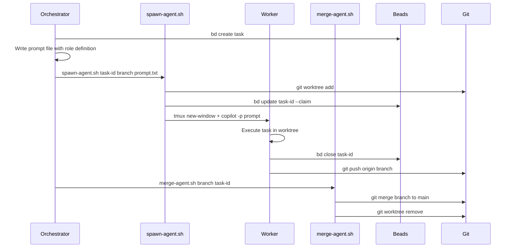
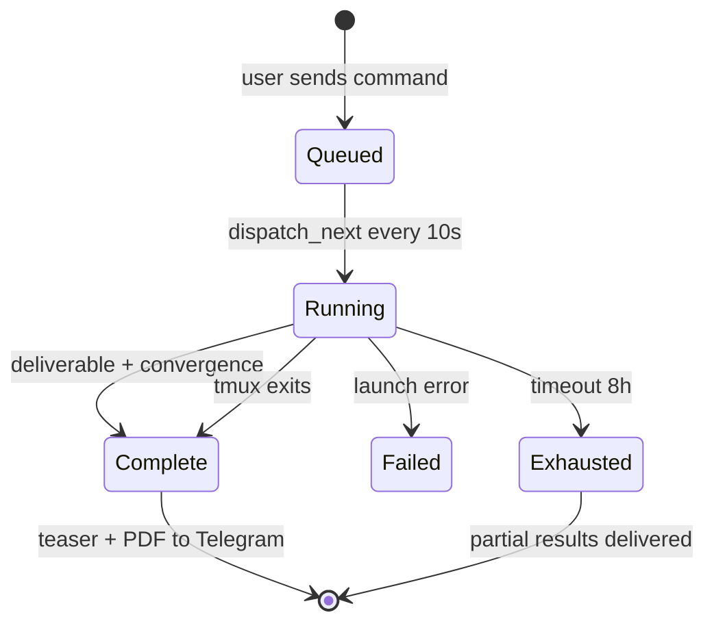
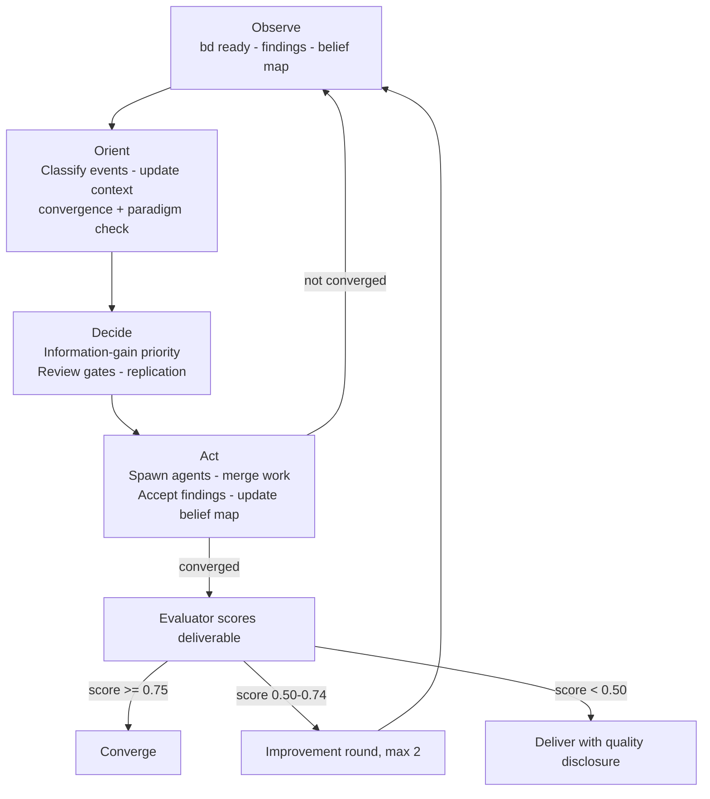

# Voronoi — Science-First Multi-Agent Orchestration

A production-ready system for orchestrating multiple AI agents in parallel. Science is a superset of engineering — design for science; engineering works by skipping the science-specific gates.

**The user types one prompt. The system classifies, adapts, and executes.**

---

## 1. Architecture

Two entry points, one execution path. Every copilot instance — CLI or Telegram — gets the same prompt, the same `.github/agents/` role definitions, and the same science gates.



---

## 2. The Two Entry Points

Both paths converge at `prompt.py` — the **single source of truth** for orchestrator prompts.



| Capability | CLI | Telegram |
|-----------|-----|----------|
| Demo files copied | ✅ `cmd_demo()` | ✅ `_copy_demo_files()` |
| `.github/` agents/skills | ✅ `voronoi init` | ✅ `_ensure_github_files()` fallback |
| Prompt builder | ✅ `prompt.py` | ✅ `prompt.py` (same function) |
| Progress updates | stdout | Telegram messages every 30s |
| Timeout detection | KeyboardInterrupt | Configurable (default 8h) |
| Completion | Agent exits | tmux dies OR deliverable.md + convergence.json |

---

## 3. `.github/` — Agent Roles, Prompts, and Skills

Copilot auto-discovers these files. They are the **real** role definitions — the prompt builder *references* them, never duplicates.

```
.github/
├── agents/                          # Role definitions (11 roles)
│   ├── swarm-orchestrator.agent.md  # OODA loop, convergence, paradigm checks
│   ├── worker-agent.agent.md        # Build tasks, artifact contracts
│   ├── scout.agent.md               # Prior knowledge research
│   ├── investigator.agent.md        # Pre-registration, sensitivity analysis
│   ├── explorer.agent.md            # Option evaluation, comparison matrices
│   ├── critic.agent.md              # Adversarial review (5-check checklist)
│   ├── theorist.agent.md            # Causal models, competing theories
│   ├── methodologist.agent.md       # Experimental design review
│   ├── statistician.agent.md        # CI, effect sizes, data integrity
│   ├── synthesizer.agent.md         # Consistency checks, deliverable
│   └── evaluator.agent.md           # Final scoring (CCSA formula)
├── prompts/                         # Invocable prompts
│   ├── swarm.prompt.md              # /swarm — full orchestration
│   ├── spawn.prompt.md              # /spawn — single agent dispatch
│   ├── merge.prompt.md              # /merge — branch integration
│   ├── standup.prompt.md            # /standup — cross-agent status
│   ├── progress.prompt.md           # /progress — progress check
│   └── teardown.prompt.md           # /teardown — cleanup
└── skills/                          # Domain knowledge (9 skills)
    ├── beads-tracking/              # bd commands, task lifecycle
    ├── git-worktree-management/     # Worktree create/merge/cleanup
    ├── branch-merging/              # Safe merge protocol
    ├── task-planning/               # Epic decomposition
    ├── artifact-gates/              # PRODUCES/REQUIRES/GATE contracts
    ├── evidence-system/             # Findings, belief maps, journal
    ├── investigation-protocol/      # Hypothesis → experiment → finding
    ├── strategic-context/           # Decision rationale across cycles
    └── agent-standup/               # Cross-agent progress aggregation
```

The prompt builder tells the orchestrator:
> *"Read `.github/agents/swarm-orchestrator.agent.md` NOW — it contains your complete role definition."*

And for each worker:
> *"Prepend the content of `.github/agents/<role>.agent.md` to every worker prompt."*

---

## 4. Classifier



| Mode | Rigor | Roles activated |
|------|-------|----------------|
| **Build** | Standard | Builder, Critic (inline) |
| **Explore** | Analytical | + Scout, Statistician, Explorer, Synthesizer, Evaluator |
| **Investigate** | Scientific | + Methodologist, Theorist, all gates |
| **Investigate** | Experimental | Full pipeline + replication |

When in doubt, classify higher — gates can be skipped but not added retroactively.

---

## 5. Role Registry

| Role | File | Activated at | Key responsibility |
|------|------|-------------|-------------------|
| Builder 🔨 | `worker-agent.agent.md` | Standard+ | Implements code in isolated worktree |
| Scout 🔍 | `scout.agent.md` | Analytical+ | Prior knowledge research, SOTA anchoring |
| Investigator 🔬 | `investigator.agent.md` | Analytical+ | Pre-registered experiments, raw data + SHA-256 |
| Explorer 🧭 | `explorer.agent.md` | Analytical+ | Option evaluation with comparison matrices |
| Statistician 📊 | `statistician.agent.md` | Analytical+ | CI, effect sizes, data integrity, p-hacking flags |
| Critic ⚖️ | `critic.agent.md` | Standard+ | Adversarial review; partially blinded at Scientific+ |
| Synthesizer 🧩 | `synthesizer.agent.md` | Analytical+ | Consistency checks, deliverable, journal |
| Evaluator 🎯 | `evaluator.agent.md` | Analytical+ | Scores deliverable: Completeness·Coherence·Strength·Actionability |
| Theorist 🧬 | `theorist.agent.md` | Scientific+ | Causal models, competing theories, paradigm stress |
| Methodologist 📐 | `methodologist.agent.md` | Scientific+ | Experimental design review, power analysis |
| Worker | `worker-agent.agent.md` | Standard+ | Generic tasks |

---

## 6. Infrastructure Scripts

Pure plumbing — no decision logic. The orchestrator (copilot) makes all decisions.

| Script | What it does |
|--------|-------------|
| `swarm-init.sh` | `git init` · `bd init` · tmux session · `.swarm-config.json` · Telegram bridge |
| `spawn-agent.sh` | `git worktree add` → tmux window → `copilot -p prompt` |
| `merge-agent.sh` | `git merge` → push → clean worktree → `bd close` |
| `notify-telegram.sh` | Source this, call `notify_telegram "event" "message"` |
| `teardown.sh` | Kill tmux, prune worktrees/branches |



---

## 7. Server Pipeline (Telegram path)



**Dispatcher responsibilities:**
- Polls `queue.db` every 10s for queued investigations
- Provisions workspace (`workspace.py`) with `.github/` files
- Builds prompt via `prompt.py` (shared builder)
- Launches copilot in tmux with `; exit` (session dies when agent finishes)
- Polls progress every 30s: `bd list --json` for task diffs, findings, phase changes
- Reads `.swarm/eval-score.json` for evaluator score propagation
- Detects completion: `deliverable.md` (standard) or `+ convergence.json` (analytical+)
- Enforces timeout (configurable, default 8h)

---

## 8. Science Framework

### Evidence layers

| Layer | Location | Purpose |
|-------|----------|---------|
| Findings | Beads entries | Effect size, CI, N, stat test, data hash, robustness |
| Raw Data | `data/raw/` | CSV/JSON with SHA-256 integrity hash |
| Belief Map | `.swarm/belief-map.json` | Hypothesis probabilities, information-gain prioritization |
| Journal | `.swarm/journal.md` | Narrative continuity across OODA cycles |
| Strategic Context | `.swarm/strategic-context.md` | Decision rationale, dead ends, remaining gaps |
| Deliverable | `.swarm/deliverable.md` | Final output artifact scored by Evaluator |
| Eval Score | `.swarm/eval-score.json` | Evaluator score for convergence tracking |

### OODA workflow



### Convergence criteria

| Rigor | Requirements |
|-------|-------------|
| Standard | All tasks closed, tests passing |
| Analytical | + Statistician reviewed, no contradictions, eval ≥ 0.75 |
| Scientific | + All hypotheses resolved, competing theory ruled out, novel prediction tested, no PARADIGM_STRESS |
| Experimental | + All high-impact findings replicated, pre-reg compliance, power analysis documented |

### Rigor gates (progressive activation)

| Gate | Standard | Analytical | Scientific | Experimental |
|------|:--------:|:----------:|:----------:|:------------:|
| Code review (Critic inline) | ✅ | ✅ | ✅ | ✅ |
| Statistician review | — | ✅ | ✅ | ✅ |
| Final evaluation | — | ✅ | ✅ | ✅ |
| Methodologist design review | — | — | ✅ advisory | ✅ mandatory |
| Pre-registration | — | — | ✅ | ✅ |
| Power analysis | — | — | ✅ | ✅ |
| Partial blinding for Critic | — | — | ✅ | ✅ |
| Adversarial review loop | — | — | ✅ | ✅ |
| Replication | — | — | — | ✅ |

---

## 9. Artifact Contracts

Tasks declare file-level dependencies in Beads notes:

```
PRODUCES: src/encoder.py, output/results.json
REQUIRES: data/raw/transactions.csv
GATE: output/validation_report.json
```

**Enforcement:** Dispatch blocked until REQUIRES/GATE exist. Merge rejected if PRODUCES missing. Worker agents check these at startup per `worker-agent.agent.md`.

---

## 10. Key Design Decisions

| Decision | Rationale |
|----------|-----------|
| Science-first | Engineering = science with gates off. Zero overhead for build-only. |
| Single prompt builder (`prompt.py`) | CLI and Telegram produce identical orchestrator behavior. |
| `.github/` as source of truth | Agent roles live in files copilot auto-discovers — not duplicated in code. |
| Prompt references not duplicates | Orchestrator told "read the file" — roles stay in sync automatically. |
| Auto-classified rigor | Users don't configure. System infers and can escalate. |
| OODA over linear pipeline | Investigations are iterative — hypothesis revision needs loops. |
| Beads for tasks, SQLite for investigations | Beads per-workspace; queue.db global. Different granularity, different lifecycle. |
| Git worktrees over clones | Shared `.git`, faster, less disk, natural cross-branch diff. |
| tmux `; exit` | Session dies when agent finishes — dispatcher detects completion. |
| Atomic queue claiming | `next_ready()` marks as running in same transaction — no double-dispatch. |
| `.github/` fallback copy | `_ensure_github_files()` copies even if `voronoi init` subprocess fails. |
| Timeout (8h default) | Prevents zombie investigations; writes exhaustion convergence. |

---

## 11. Module Map

```
voronoi/
├── cli.py                  # voronoi init · demo · upgrade · server
├── science.py              # Pre-registration · belief map · convergence · integrity
├── gateway/
│   ├── intent.py           # Free-text → mode + rigor classification
│   ├── router.py           # Command dispatch (investigate · demo · status · guide)
│   ├── config.py           # .env + .swarm-config.json loading
│   ├── memory.py           # Conversation history (SQLite)
│   ├── knowledge.py        # Knowledge store queries
│   ├── progress.py         # Progress bar formatting, phase labels
│   ├── report.py           # Teaser + PDF generation
│   ├── codename.py         # Brain-themed codenames
│   └── handoff.py          # Voronoi → Anton/MVCHA fix handoff
└── server/
    ├── prompt.py           # ⭐ Unified orchestrator prompt builder
    ├── queue.py            # Investigation queue (SQLite, atomic claiming)
    ├── dispatcher.py       # Launch · progress poll · timeout · completion
    ├── workspace.py        # Provision lab/repo workspaces + .github/ fallback
    ├── runner.py           # Server config, slug generation
    ├── publisher.py        # GitHub repo publishing
    ├── sandbox.py          # Docker sandbox config
    └── repo_url.py         # GitHub URL extraction
```