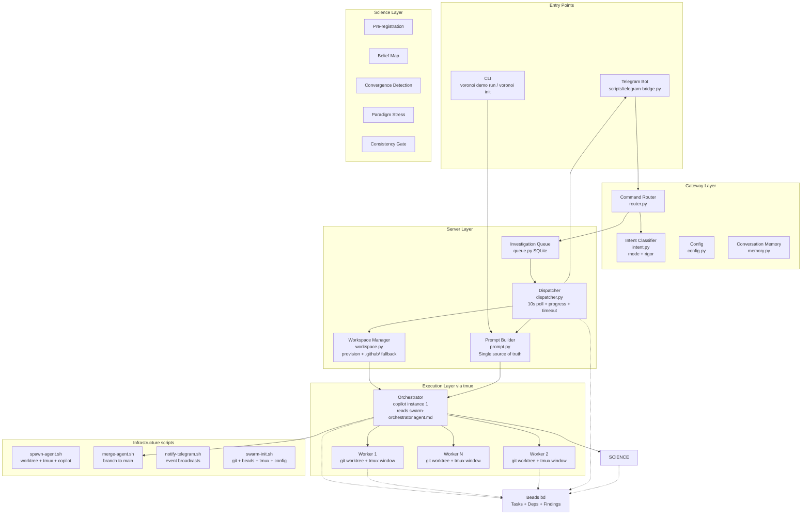
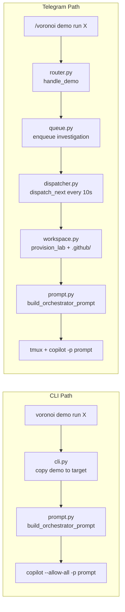
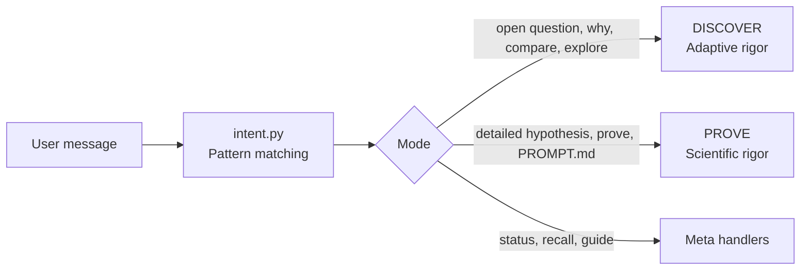
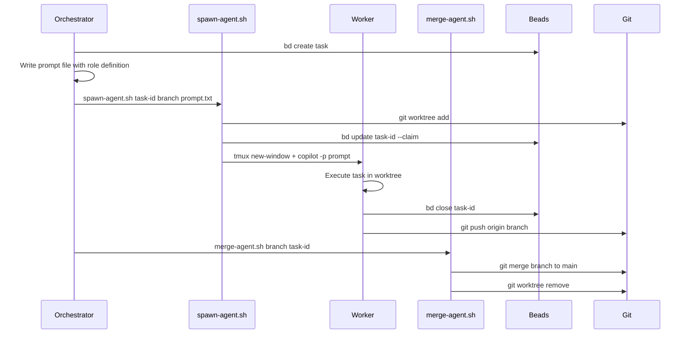
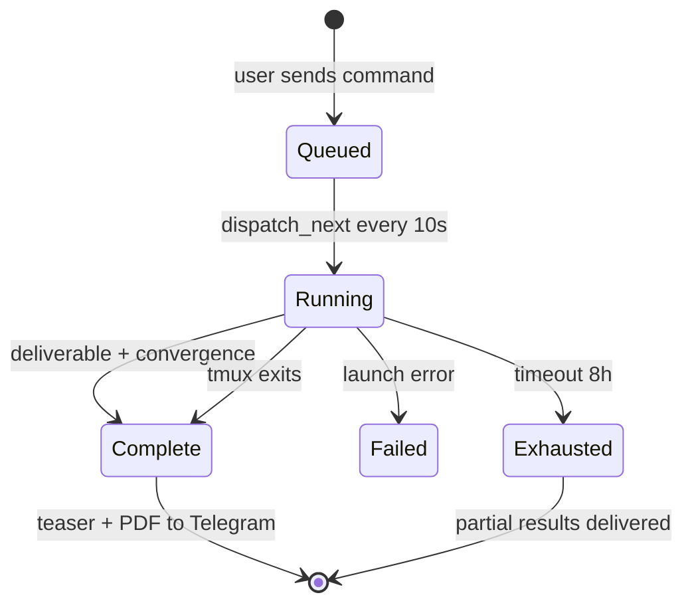
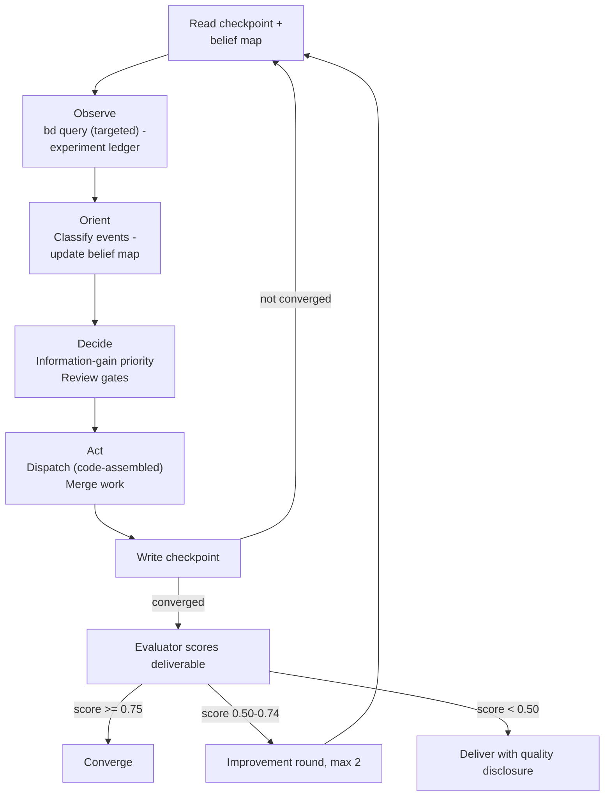
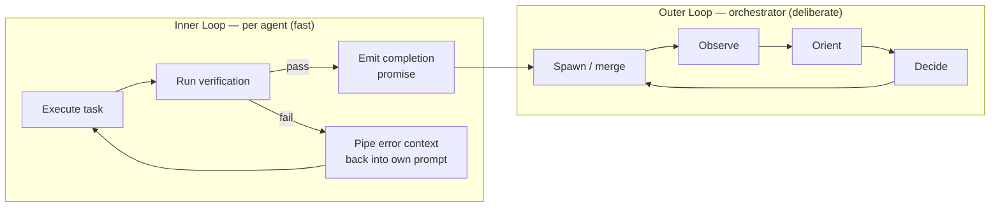

# Voronoi — Science-First Multi-Agent Orchestration

A production-ready system for orchestrating multiple AI agents in parallel. Science is a superset of engineering — design for science; engineering works by skipping the science-specific gates.

**The user types one prompt. The system classifies, adapts, and executes.**

---

## 1. Architecture

Two entry points, one execution path. Every copilot instance — CLI or Telegram — gets the same prompt, the same `src/voronoi/data/agents/` role definitions, and the same science gates.



---

## 2. The Two Entry Points

Both paths converge at `prompt.py` — the **single source of truth** for orchestrator prompts.



| Capability | CLI | Telegram |
|-----------|-----|----------|
| Demo files copied | ✅ `cmd_demo()` | ✅ `_copy_demo_files()` |
| Runtime agents/skills | ✅ `voronoi init` | ✅ `_ensure_github_files()` fallback |
| Prompt builder | ✅ `prompt.py` | ✅ `prompt.py` (same function) |
| Progress updates | stdout | Telegram messages every 30s |
| Timeout detection | KeyboardInterrupt | Configurable (default 8h) |
| Completion | Agent exits | tmux dies OR deliverable.md + convergence.json |

---

## 3. File Audience Separation

Voronoi strictly separates files by audience:

| Files | Audience | Shipped with pip? |
|-------|----------|:-:|
| `CLAUDE.md` (repo root) | Developers working ON Voronoi | No |
| `docs/*.md` | Developers working ON Voronoi | No |
| `src/voronoi/data/templates/CLAUDE.md` | Investigation agents working WITH Voronoi | Yes |
| `src/voronoi/data/agents/` | Investigation agents (runtime role definitions) | Yes |
| `src/voronoi/data/scripts/` | Runtime scripts (spawn, merge, convergence) | Yes |
| `scripts/` (repo root) | Dev-only build tool (`sync-package-data.sh`) | No |

All runtime content lives in `src/voronoi/data/` — the single canonical location.
`sync-package-data.sh` only copies `.env.example` into `data/` before `pip install .`.

---

## 3b. Iterative Science — Multi-Run Design

### The Problem

Science is iterative. A single autonomous run produces one sample from a reasoning distribution — not truth. The user needs to review results, raise doubts, lock what's solid, and trigger another round that builds on (not replaces) prior work.

### Solution: Claim Ledger as Spine

The Claim Ledger (`science/claims.py`) is a durable, cross-run scientific object stored at `~/.voronoi/ledgers/<lineage_id>/claim-ledger.json`. It tracks:

- **Claims** with provenance tags (`model_prior` | `retrieved_prior` | `run_evidence`)
- **Status lifecycle**: `provisional → asserted → locked → replicated` (or `challenged` / `retired` at any point)
- **Objections**: structured doubts targeting specific claims
- **Artifact chains**: which files (code, data) support each claim

### Iteration Flow

1. Run converges → dispatcher syncs findings to Claim Ledger → status becomes `review`
2. PI reviews: locks solid claims, challenges weak ones, adds objections
3. PI says `/continue` → workspace prepared (archive `.swarm/`, tag git, prune worktrees, write immutability invariants)
4. New orchestrator starts with Warm-Start Brief from Claim Ledger
5. Locked claims → DO NOT re-test. Challenged claims → priority. New questions → explore.

### Key Properties

- **Runs are additive**: code and data accumulate. Only the paper is rewritten per round.
- **Stochasticity is managed**: locked findings can't regress due to random variation.
- **LLM priors are tagged**: model knowledge enters as `model_prior` and must earn promotion.
- **Self-critique**: auto-identifies weaknesses before showing the PI.
- **Workspace reuse**: same git repo across rounds, with git tags at run boundaries.

---

## 4. Agent Roles, Prompts, and Skills — `src/voronoi/data/`

The canonical location for all runtime content is `src/voronoi/data/`. The prompt builder *references* these files, never duplicates.

```
src/voronoi/data/
├── agents/                          # Role definitions (12 roles)
│   ├── swarm-orchestrator.agent.md  # OODA loop, convergence, paradigm checks
│   ├── worker-agent.agent.md        # Build tasks, artifact contracts
│   ├── scout.agent.md               # Prior knowledge research
│   ├── investigator.agent.md        # Pre-registration, sensitivity analysis
│   ├── explorer.agent.md            # Option evaluation, comparison matrices
│   ├── critic.agent.md              # Adversarial review (5-check checklist)
│   ├── theorist.agent.md            # Causal models, competing theories
│   ├── methodologist.agent.md       # Experimental design review
│   ├── statistician.agent.md        # CI, effect sizes, data integrity
│   ├── synthesizer.agent.md         # Consistency checks, deliverable
│   ├── evaluator.agent.md           # Final scoring (CCSA formula)
│   └── scribe.agent.md              # LaTeX compilation, figures
├── prompts/                         # Invocable prompts
│   ├── spawn.prompt.md              # /spawn — single agent dispatch
│   ├── merge.prompt.md              # /merge — branch integration
│   ├── standup.prompt.md            # /standup — cross-agent status
│   ├── progress.prompt.md           # /progress — progress check
│   └── teardown.prompt.md           # /teardown — cleanup
├── skills/                          # Domain knowledge (9 skills)
│   ├── beads-tracking/              # bd commands, task lifecycle
│   ├── git-worktree-management/     # Worktree create/merge/cleanup
│   ├── branch-merging/              # Safe merge protocol
│   ├── task-planning/               # Epic decomposition
│   ├── artifact-gates/              # PRODUCES/REQUIRES/GATE contracts
│   ├── evidence-system/             # Findings, belief maps, journal
│   ├── investigation-protocol/      # Hypothesis → experiment → finding
│   ├── strategic-context/           # Decision rationale across cycles
│   └── agent-standup/               # Cross-agent progress aggregation
├── scripts/                         # Runtime shell scripts
├── demos/                           # Demo investigations
└── templates/                       # CLAUDE.md + AGENTS.md for workspaces
```

During `voronoi init`, agents/prompts/skills are copied to `.github/` in the target workspace. The prompt builder tells the orchestrator:
> *"Read `.github/agents/swarm-orchestrator.agent.md` NOW — it contains your complete role definition."*

And for each worker, `build_worker_prompt()` reads the role file from `data/agents/` and prepends it to the prompt.

---

## 4. Two Science Modes: DISCOVER and PROVE

Voronoi has two science modes and three meta modes. The old seven-mode × four-rigor matrix (BUILD, INVESTIGATE, EXPLORE, HYBRID × STANDARD/ANALYTICAL/SCIENTIFIC/EXPERIMENTAL) is replaced by two intent-driven modes with **adaptive rigor**.



| Mode | User gives | Rigor | How it works |
|------|-----------|-------|--------------|
| **DISCOVER** | An open question — "go figure this out" | Adaptive — starts analytical, escalates to scientific when hypotheses crystallize | Free exploration. Scout first, form hypotheses, pursue multiple paths in parallel. Agents explore creatively. Orchestrator casts roles dynamically based on what it finds. |
| **PROVE** | A specific hypothesis or detailed PROMPT.md | Scientific/Experimental — full gates from the start | Structured hypothesis testing. Pre-registration, controlled experiments, statistical validation, replication for high-impact findings. |
| **STATUS** | (meta) | — | Query swarm state |
| **RECALL** | (meta) | — | Search knowledge store |
| **GUIDE** | (meta) | — | Operator guidance |

### Why two modes?

- **BUILD, INVESTIGATE, EXPLORE, HYBRID were artificial distinctions.** When someone says "figure out why X is slow," they want discovery — whether that involves building test harnesses, exploring alternatives, or investigating causally. The orchestrator decides the approach, not the classifier.
- **Adaptive rigor in DISCOVER mirrors real science.** You don't pre-register before you even know what you're looking at. Start with Scout + exploration; when real hypotheses emerge, engage Methodologist + Statistician.
- **PROVE is for when the user has already done the discovery mentally.** Detailed PROMPT.md files (like coupled-decisions) skip exploration and go straight to rigorous testing.

### Creative Freedom Protocol (DISCOVER mode)

- No rigid "Scout first → plan → dispatch by role" sequence
- Orchestrator casts roles dynamically based on what it finds
- Multiple agents can pursue different hypotheses simultaneously
- `SERENDIPITY` events — when an agent finds something unexpected, the orchestrator can pivot the entire investigation
- Rigor escalates automatically: if belief map shows testable hypotheses, engage pre-registration and review gates

---

## 5. Role Registry

All 12 roles are available in both DISCOVER and PROVE modes. The difference is **when** they activate:
- **PROVE**: Full role set from the start (pre-registration, methodologist review, etc.)
- **DISCOVER**: Orchestrator casts roles dynamically as the investigation evolves

| Role | File | DISCOVER | PROVE | Key responsibility |
|------|------|----------|-------|-------------------|
| Builder 🔨 | `worker-agent.agent.md` | On demand | On demand | Implements code in isolated worktree |
| Scout 🔍 | `scout.agent.md` | Always first | Always first | Prior knowledge research, SOTA anchoring |
| Investigator 🔬 | `investigator.agent.md` | When hypotheses emerge | From start | Pre-registered experiments, raw data + SHA-256 |
| Explorer 🧭 | `explorer.agent.md` | When comparing options | When comparing options | Option evaluation with comparison matrices |
| Statistician 📊 | `statistician.agent.md` | When rigor escalates | From start | CI, effect sizes, data integrity, p-hacking flags |
| Critic ⚖️ | `critic.agent.md` | On demand | From start | Adversarial review; partially blinded at high rigor |
| Synthesizer 🧩 | `synthesizer.agent.md` | At convergence | Before convergence | Consistency checks, deliverable, journal |
| Evaluator 🎯 | `evaluator.agent.md` | At convergence | Before convergence | Scores deliverable: Completeness·Coherence·Strength·Actionability |
| Theorist 🧬 | `theorist.agent.md` | When hypotheses emerge | From start | Causal models, competing theories, paradigm stress |
| Methodologist 📐 | `methodologist.agent.md` | When rigor escalates | From start (mandatory) | Experimental design review, power analysis |
| Scribe ✍️ | `scribe.agent.md` | On demand | On demand | LaTeX compilation, figure generation |
| Worker | `worker-agent.agent.md` | On demand | On demand | Generic tasks |

---

## 6. Infrastructure Scripts

Pure plumbing — no decision logic. The orchestrator (copilot) makes all decisions.

| Script | What it does |
|--------|-------------|
| `spawn-agent.sh` | `git worktree add` → tmux window → `copilot -p prompt` |
| `merge-agent.sh` | `git merge` → push → clean worktree → `bd close` |
| `convergence-gate.sh` | Multi-signal convergence validation + figure-lint |
| `health-check.sh` | Agent health monitoring (tmux + git + process tree) |
| `swarm-init.sh` | `git init` · `bd init` · tmux session · config |
| `notify-telegram.sh` | Source this, call `notify_telegram "event" "message"` |
| `figure-lint.sh` | Verify all `\includegraphics` refs resolve |
| `teardown.sh` | Kill tmux, prune worktrees/branches |
| `sync-package-data.sh` | Copy framework files for pip build |
| `dashboard.py` | Rich terminal dashboard (optional dev tool) |
| `telegram-bridge.py` | Telegram ↔ Voronoi gateway |

### Copilot CLI Flags

The dispatcher and `spawn-agent.sh` inject flags at agent launch time:

| Flag | Applied to | Purpose |
|------|-----------|---------|
| `--effort <level>` | All agents | Reasoning depth scaled by rigor (medium→high→xhigh) |
| `--share .swarm/session.md` | All agents | Clean markdown audit trail per session |
| `--deny-tool=write` | Read-only roles (scout, critic, statistician, methodologist) | Structural role permission enforcement |

Context pressure management uses Copilot CLI's `/compact` command — native conversation compression that recovers 60-70% of context budget without restarting the agent.



---

## 7. Server Pipeline (Telegram path)



**Dispatcher responsibilities:**
- Polls `queue.db` every 10s for queued investigations
- Provisions workspace (`workspace.py`) with `.github/` files
- Builds prompt via `prompt.py` (shared builder)
- Launches copilot in tmux with `; exit` (session dies when agent finishes)
- Polls progress every 30s: `bd list --json` for task diffs, findings, phase changes
- Builds narrative digest messages (buddy-style) via `progress.py:build_digest()`
- Reads `.swarm/experiments.tsv` and `.swarm/success-criteria.json` for track assessment
- Reads `.swarm/eval-score.json` for evaluator score propagation
- Detects completion: `deliverable.md` (standard) or `+ convergence.json` (analytical+)
- Enforces timeout (configurable, default 8h)

### Telegram Notifications

Messages use a conversational buddy style — narrative updates instead of data dumps.

**Three tiers:**
- *Alert* (immediate) — agent died, design invalid, stall, auth expired
- *Digest* (every 30s when events) — what happened, where we are, track status, what's next
- *Milestone* (on transition) — phase change, completion, failure

**Pull commands (via `/voronoi`):**
- `status` / `whatsup` — unified what's-happening overview (tasks + agents + phase)
- `progress` / `howsitgoing` — experiment metrics, success criteria, belief map, track assessment
- `belief` · `journal` · `finding <id>` — knowledge lookups (resolved to investigation workspace)
- `guide <msg>` · `pivot <msg>` — operator guidance (written to all active workspaces)
- `abort` — stop all running investigations

---

## 8. Science Framework

### Evidence layers

| Layer | Location | Purpose |
|-------|----------|---------|
| Findings | Beads entries | Effect size, CI, N, stat test, data hash, robustness |
| Raw Data | `data/raw/` | CSV/JSON with SHA-256 integrity hash |
| Belief Map | `.swarm/belief-map.json` | Hypothesis probabilities, information-gain prioritization |
| Journal | `.swarm/journal.md` | Narrative continuity across OODA cycles |
| Strategic Context | `.swarm/strategic-context.md` | Decision rationale, dead ends, remaining gaps |
| Orchestrator Checkpoint | `.swarm/orchestrator-checkpoint.json` | Compressed orchestrator state — survives restarts |
| Experiment Ledger | `.swarm/experiments.tsv` | Append-only chronological record of all experiments |
| Verify Logs | `.swarm/verify-log-<id>.jsonl` | Per-task iteration history for self-healing agents |
| Deliverable | `.swarm/deliverable.md` | Final output artifact scored by Evaluator |
| Eval Score | `.swarm/eval-score.json` | Evaluator score for convergence tracking |

### Context Management

The orchestrator uses a **checkpoint-driven OODA loop** to keep context bounded during long runs (~2-4K tokens/cycle vs ~20K+ without). See [docs/CONTEXT-MANAGEMENT.md](docs/CONTEXT-MANAGEMENT.md) for the full design.

Key mechanisms:
- **Checkpoint file** — written after every OODA cycle, read at cycle start
- **Targeted Beads queries** — `bd query "updated>30m"` instead of `bd list --json`
- **Code-assembled worker prompts** — `build_worker_prompt()` reads role files from disk
- **Belief map as lossy compression** — findings → posteriors, then forget details

### OODA workflow



### Convergence criteria

| Rigor | Requirements |
|-------|-------------|
| Standard | All tasks closed, tests passing |
| Analytical | + Statistician reviewed, no contradictions, eval ≥ 0.75 |
| Scientific | + All hypotheses resolved, competing theory ruled out, novel prediction tested, no PARADIGM_STRESS |
| Experimental | + All high-impact findings replicated, pre-reg compliance, power analysis documented |

### Rigor gates (progressive activation)

| Gate | Standard | Analytical | Scientific | Experimental |
|------|:--------:|:----------:|:----------:|:------------:|
| Code review (Critic inline) | ✅ | ✅ | ✅ | ✅ |
| Statistician review | — | ✅ | ✅ | ✅ |
| Finding interpretation | — | ✅ | ✅ | ✅ |
| Claim-evidence registry | — | ✅ | ✅ | ✅ |
| Final evaluation | — | ✅ | ✅ | ✅ |
| Methodologist design review | — | — | ✅ advisory | ✅ mandatory |
| Pre-registration | — | — | ✅ | ✅ |
| Pre-reg compliance audit | — | — | ✅ | ✅ |
| Power analysis | — | — | ✅ | ✅ |
| Partial blinding for Critic | — | — | ✅ | ✅ |
| Adversarial review loop | — | — | ✅ | ✅ |
| Replication | — | — | — | ✅ |

### Claim-Evidence Traceability (Analytical+)

Every claim in the deliverable must trace to specific finding IDs via `.swarm/claim-evidence.json`. The Synthesizer produces this registry before writing the deliverable; the Evaluator audits it during Strength scoring.

```
Synthesizer → claim-evidence.json → deliverable.md → Evaluator audit
```

**Each claim entry contains:** claim text, supporting finding IDs, hypothesis IDs, strength label (robust/provisional/weak/unsupported), and interpretation text.

**Audit flags:** Orphan findings (uncited), unsupported claims (no evidence), coverage score.

### Finding Interpretation (Analytical+)

The Statistician adds interpretation metadata to every approved finding:

| Field | Description | Example |
|-------|-------------|---------|
| `INTERPRETATION` | Practical meaning in domain context | "Encoding produces 82% better cross-lever detection" |
| `PRACTICAL_SIGNIFICANCE` | Cohen's d category | negligible/small/medium/large/very large |
| `SUPPORTS_HYPOTHESIS` | Which hypothesis this tests | "H1: Encoding helps" |

The report generator uses these fields to produce interpreted findings (not just raw numbers) and auto-generates: cross-finding comparison, negative results section, limitations from fragile/wide-CI findings, and belief map trajectory.

---

## 9. Artifact Contracts

Tasks declare file-level dependencies in Beads notes:

```
PRODUCES: src/encoder.py, output/results.json
REQUIRES: data/raw/transactions.csv
GATE: output/validation_report.json
```

**Enforcement:** Dispatch blocked until REQUIRES/GATE exist. Merge rejected if PRODUCES missing. Worker agents check these at startup per `worker-agent.agent.md`.

### Simplicity criterion

All else being equal, simpler is better. When evaluating whether to keep a change (especially in build and investigation tasks), weigh complexity cost against improvement magnitude:

- A small improvement that adds significant complexity is **not worth keeping**
- A small improvement from **deleting** code is **always worth keeping**
- Equal results with simpler code is a **simplification win** — keep it
- The Critic evaluates complexity cost as part of its review checklist
- The Evaluator penalizes deliverables that include unnecessary complexity

---

## 10. Verify Loop (Self-Healing Agents)

Inspired by the Ralph Wiggum technique and autoresearch's keep/discard inner loop. Every worker agent runs an internal **verify loop** before declaring success or failure to the orchestrator. This separates the fast **inner loop** (agent iterates against its own errors) from the deliberate **outer loop** (orchestrator OODA cycle).

### The Two Loops



### Per-role verify loops

| Role | Verification | Completion Promise | Max Iterations |
|------|-------------|-------------------|----------------|
| **Builder** | Tests pass + lint clean + PRODUCES exist | `BUILD_COMPLETE` | 5 |
| **Investigator** | Experiment runs without crash + metric extracted + **EVA passed** + raw data committed | `EXPERIMENT_COMPLETE` | 3 per variant |
| **Scout** | Knowledge brief written + sources cited | `SCOUT_COMPLETE` | 3 |
| **Critic** | All 5 checklist items evaluated | `REVIEW_COMPLETE` | 2 |
| **Synthesizer** | Claim-evidence registry complete + no orphan findings | `SYNTHESIS_COMPLETE` | 3 |

### How it works

1. **Agent attempts the task** — writes code, runs experiments, etc.
2. **Verification step** — agent runs its verification suite (tests, lint, metric extraction, artifact existence check).
3. **On failure** — the error output (stack trace, test failures, lint errors) is piped back as context for the next attempt. The agent does NOT escalate to the orchestrator yet.
4. **On success** — for Investigators, runs the **Experimental Validity Audit (EVA)** before declaring completion. For other roles, emits completion promise.
5. **EVA failure** — if the experiment produced a number but didn't actually test what it claimed (e.g., conditions were identical due to truncation), the agent flags `DESIGN_INVALID` and escalates with a diagnosis. The orchestrator dispatches the Methodologist for post-mortem review.
6. **On max iterations exceeded** — escalates to orchestrator with structured failure report including all attempted approaches.

### Verify loop output contract

Each verify iteration appends to `.swarm/verify-log-<task-id>.jsonl`:

```json
{"iteration": 1, "status": "fail", "error_type": "test_failure", "summary": "3 of 12 tests failed", "timestamp": "..."}
{"iteration": 2, "status": "fail", "error_type": "lint", "summary": "unused import in encoder.py", "timestamp": "..."}
{"iteration": 3, "status": "pass", "summary": "all tests pass, lint clean, PRODUCES verified", "timestamp": "..."}
```

This gives the orchestrator a structured diagnostic if the agent fails — not just "it didn't work" but "it tried 5 times and here's what each attempt hit."

### Context management

The verify loop is designed to work within a single agent session. To prevent context bloat:
- Error output is summarized before re-injection (last 50 lines of stack trace, not full output)
- Previous attempt logs are referenced by file path, not pasted inline
- On the final iteration, the agent writes a `VERIFY_EXHAUSTED` note to Beads with a structured summary

---

## 10b. Experimental Validity Audit (EVA)

The verify loop (§10) catches **execution failures** — crashes, missing metrics, broken scripts. But a subtler failure mode exists: experiments that run successfully and produce numbers, but **don't actually test what they claim**. This happens when practical constraints (context window limits, memory ceilings, caching) silently collapse the independent variable so all conditions are identical.

The EVA is a mandatory step for Investigators, inserted **between the verify loop passing and the finding being committed**.

### The problem it solves

Consider an encoding ablation study with 4 levels (Naive RAG → Full Structured). The encoder produces 33K chars at Level 1, but the LLM context window truncates everything to 6K chars. All four levels now present identical content to the LLM. The experiment "runs successfully" — it produces F1 scores for each level — but it measured nothing. Without EVA, this meaningless result gets committed as a "finding," reviewed by the Statistician (who sees a legitimate null result), and enters the deliverable as evidence.

### Three mandatory checks

| Check | Question | Catches |
|-------|----------|--------|
| **Manipulation check** | Was the independent variable actually varied across conditions? | Truncation collapse, identical configs, caching, shared state |
| **Artifact check** | Did practical constraints nullify the manipulation? | Context window limits, memory ceilings, rate limiting, overflow |
| **Sanity check** | Is the effect size plausible given the design? | Distinguishes genuine null results (valid experiment) from broken manipulations |

### Decision tree

```
Experiment produces a number
  │
  ├─ EVA check 1: Were conditions actually different? ── NO → DESIGN_INVALID
  │
  ├─ EVA check 2: Any practical artifacts? ── YES → DESIGN_INVALID
  │
  ├─ EVA check 3: Effect size ~ 0?
  │     ├─ Manipulation verified? YES → Valid null result → report as negative finding
  │     └─ Manipulation broken? → DESIGN_INVALID
  │
  └─ All pass → commit finding
```

### Escalation path for DESIGN_INVALID

1. Investigator flags `DESIGN_INVALID` with diagnosis and proposed fix
2. Orchestrator classifies this as a `design_invalid` event in its OODA Orient phase
3. Orchestrator dispatches Methodologist for **post-mortem design review**
4. Methodologist diagnoses root cause and prescribes a specific redesign with a validation step
5. Orchestrator creates a new corrected experiment task
6. The new task's first step is **validation**: confirm the fix actually resolves the root cause before running the full experiment

The key principle: **a null result from a valid experiment is a valuable finding; a null result from an invalid experiment is garbage.** The EVA distinguishes the two.

---

## 11. Metric Contracts

Every investigation task operates against a **metric contract** — a structured agreement between orchestrator and worker about what success looks like. This bridges the gap between autoresearch's single fixed metric (`val_bpb`) and Voronoi's open-ended investigations where the metric is part of the research question.

### The problem

The orchestrator dispatches an investigator to "test whether EWC prevents catastrophic forgetting." But at dispatch time, nobody knows the exact metric. The investigator might measure accuracy retention, Fisher information divergence, or gradient interference. Without a contract, the orchestrator can't compare results across agents or determine if a result is meaningful.

### Metric contract structure

At dispatch, the orchestrator declares a **metric shape** in the task notes:

```
METRIC_CONTRACT:
  PRIMARY: {name: TBD, direction: lower_is_better|higher_is_better, type: numeric|categorical|binary}
  CONSTRAINT: {name: "runtime_seconds", max: 600}
  BASELINE_TASK: bd-17
  ACCEPTANCE: {min_effect_size: 0.5, max_p_value: 0.05}
```

The worker fills in the concrete metric at pre-registration time:

```
METRIC_FILLED:
  PRIMARY: {name: "accuracy_retention_pct", direction: higher_is_better, baseline_value: 45.2}
  CONSTRAINT: {name: "runtime_seconds", actual: 312}
```

### Metric contract flow

| Step | Who | What |
|------|-----|------|
| Dispatch | Orchestrator | Declares metric shape + baseline task reference |
| Pre-registration | Worker | Fills concrete metric name, expected value, stat test |
| Execution | Worker | Runs experiment, logs raw data |
| Self-eval | Worker | Compares result to baseline — binary keep/discard for inner loop |
| Finding | Worker | Reports structured finding with effect size, CI, N |
| Metric review | Statistician | Validates metric choice is appropriate for the hypothesis |
| Cross-agent comparison | Orchestrator | Compares findings across agents using the metric contracts |

### Metric categories

Most investigation tasks fall into a handful of shapes:

| Task Type | Typical Primary Metric | Direction | Common Constraint |
|-----------|----------------------|-----------|-------------------|
| Performance comparison | Accuracy, F1, loss, throughput | context-dependent | Runtime, memory |
| Ablation study | Delta from baseline | smaller = less important | None |
| Scaling experiment | Metric at different N | varies | Compute budget |
| Bug investigation | Reproduction rate, error magnitude | lower = better | None |
| Architecture search | val_loss (autoresearch-style) | lower = better | VRAM, time |
| Build task | Tests passing, lint clean | binary | None |

### Baseline-first protocol

Every investigation epic's **first subtask** is always a baseline measurement. This is a hard gate:

1. Orchestrator creates baseline task as first subtask of every investigation epic
2. All experimental tasks depend on (are blocked by) the baseline task
3. Baseline finding becomes the anchor in `.swarm/belief-map.json`
4. All subsequent agents receive the baseline finding ID and value in their `METRIC_CONTRACT`
5. Workers can self-evaluate ("my result vs baseline") without waiting for a Statistician

---

## 12. Experiment Ledger

Every experiment — success, failure, or crash — is logged to a flat, append-only, human-readable TSV file. This doesn't replace Beads findings; it provides a quick chronological audit trail that the orchestrator and human can scan in seconds.

### Location

`.swarm/experiments.tsv` — created by the orchestrator at investigation start.

### Format

```
timestamp	task_id	branch	metric_name	metric_value	status	description
2026-03-11T08:15:00Z	bd-17	baseline	accuracy_retention_pct	45.2	keep	Baseline: sequential training, no mitigation
2026-03-11T08:22:00Z	bd-18	ewc-agent	accuracy_retention_pct	67.8	keep	EWC lambda=400, Fisher computed on task boundaries
2026-03-11T08:30:00Z	bd-19	replay-agent	accuracy_retention_pct	0.0	crash	OOM at buffer_size=50000
2026-03-11T08:38:00Z	bd-19	replay-agent	accuracy_retention_pct	61.3	keep	Replay buffer_size=10000 (reduced after OOM)
```

### Rules

- Tab-separated (commas break in descriptions)
- Header row written at investigation start
- Each agent appends exactly one row per experiment attempt (including crashes)
- `status` is one of: `keep`, `discard`, `crash`
- `metric_value` is `0.0` for crashes
- The orchestrator reads this file at each OODA observe step for a quick overview
- This file is NOT committed to git (`.gitignore`); it's ephemeral workspace state

---

## 13. Key Design Decisions

| Decision | Rationale |
|----------|-----------|
| Science-first | Engineering = science with gates off. Zero overhead for build-only. |
| Single prompt builder (`prompt.py`) | CLI and Telegram produce identical orchestrator behavior. |
| `.github/` as source of truth | Agent roles live in files copilot auto-discovers — not duplicated in code. |
| Prompt references not duplicates | Orchestrator told "read the file" — roles stay in sync automatically. |
| Auto-classified rigor | Users don't configure. System infers and can escalate. |
| OODA over linear pipeline | Investigations are iterative — hypothesis revision needs loops. |
| Beads for tasks, SQLite for investigations | Beads per-workspace; queue.db global. Different granularity, different lifecycle. |
| Git worktrees over clones | Shared `.git`, faster, less disk, natural cross-branch diff. |
| tmux `; exit` | Session dies when agent finishes — dispatcher detects completion. |
| Atomic queue claiming | `next_ready()` marks as running in same transaction — no double-dispatch. |
| `.github/` fallback copy | `_ensure_github_files()` copies even if `voronoi init` subprocess fails. |
| Timeout (8h default) | Prevents zombie investigations; writes exhaustion convergence. |
| Inner verify loop before escalation | Workers retry against own errors (Ralph pattern) before bothering orchestrator. |
| **Experimental Validity Audit (EVA)** | Catches experiments that run but don't test what they claim (truncation, caching, collapsed conditions). Prevents meaningless results from entering the evidence store. |
| Metric contracts (shape at dispatch, fill at pre-reg) | Bridges open-ended investigations with comparable cross-agent metrics. |
| Baseline-first as hard gate | Every investigation has a control measurement; all experiments are comparable. |
| Orchestrator never enters worktrees | Orchestrator dispatches and monitors; it never fixes code in a worker's worktree. If an agent fails, dispatch a new agent or Methodologist. |
| Append-only experiment ledger | Quick chronological audit trail; greppable and human-readable. |
| File-mediated orchestrator state | Orchestrator externalizes state to `.swarm/` files between OODA cycles; prevents context loss on compaction. |
| Log-redirect + grep for metrics | Workers redirect command output to files and extract metrics with grep, preserving context window for reasoning. |

---

## 14. Module Map

```
voronoi/
├── cli.py                  # voronoi init · demo · upgrade · server
├── utils.py                # Shared field extraction, note parsing, title cleaning
├── science/                # Science gate enforcement (subpackage)
│   ├── __init__.py         # Re-exports all public symbols
│   ├── consistency.py      # Beads queries, consistency, paradigm stress, interpretation
│   ├── convergence.py      # Belief map, checkpoint, convergence detection
│   ├── fabrication.py      # Anti-fabrication, simulation bypass
│   ├── gates.py            # Dispatch/merge gates, pre-reg, invariants, calibration
│   └── claims.py           # Claim Ledger — cross-run scientific state
├── gateway/
│   ├── intent.py           # Free-text → mode + rigor classification
│   ├── router.py           # Command dispatch (thin layer, delegates to handlers)
│   ├── handlers_query.py   # Read-only status/progress/knowledge handlers
│   ├── handlers_mutate.py  # Task/investigation state changes
│   ├── handlers_workflow.py # Investigation enqueue (discover/prove/demo)
│   ├── config.py           # .env + .swarm-config.json loading
│   ├── memory.py           # Conversation history (SQLite)
│   ├── knowledge.py        # Knowledge store queries
│   ├── progress.py         # Progress bar formatting, phase labels
│   ├── report.py           # Report/manuscript generation facade
│   ├── evidence.py         # Evidence extraction and rendering
│   ├── pdf.py              # PDF generation strategy chain
│   ├── codename.py         # Brain-themed codenames
│   └── handoff.py          # Voronoi → Anton/MVCHA fix handoff
└── server/
    ├── prompt.py           # ⭐ Unified orchestrator prompt builder
    ├── queue.py            # Investigation queue (SQLite, atomic claiming)
    ├── dispatcher.py       # Progress poll · timeout · completion
    ├── tmux.py             # TMux session launch, auth, cleanup
    ├── snapshot.py         # WorkspaceSnapshot — read-only .swarm/ state
    ├── workspace.py        # Provision lab/repo workspaces + .github/ fallback
    ├── runner.py           # Server config, slug generation
    ├── publisher.py        # GitHub repo publishing
    ├── compact.py          # Workspace state compaction
    ├── events.py           # Structured event log
    ├── sandbox.py          # Docker sandbox config
    └── repo_url.py         # GitHub URL extraction
```