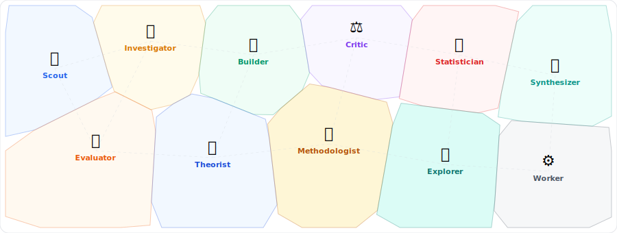
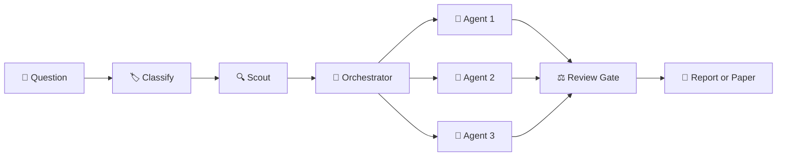
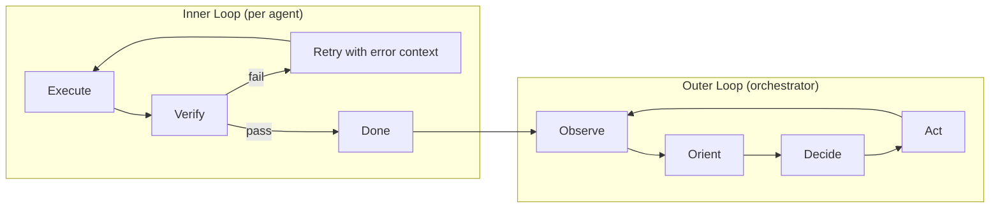

<div align="center">

# Voronoi

**Ask a question. Get evidence.**

<br/>

<picture>
  <source media="(prefers-color-scheme: dark)" srcset="assets/voronoi-banner.svg" />
  <source media="(prefers-color-scheme: light)" srcset="assets/voronoi-banner-light.svg" />
  
</picture>

<br/>

[](https://python.org)
[](https://github.com/features/copilot)
[](https://core.telegram.org/bots)
[](./LICENSE)

<br/>



<sub>Open question → scout → parallel agents → failure → OODA loop → new hypothesis → convergence → manuscript</sub>

<br/>

<details>
<summary>Hypothesis proof</summary>
<br/>

</details>

<br/>
<br/>

<a href="#install"><strong>Install</strong></a>&nbsp;&nbsp;&middot;&nbsp;&nbsp;<a href="#how-it-works"><strong>How It Works</strong></a>&nbsp;&nbsp;&middot;&nbsp;&nbsp;<a href="#commands"><strong>Commands</strong></a>&nbsp;&nbsp;&middot;&nbsp;&nbsp;<a href="#demos"><strong>Demos</strong></a>&nbsp;&nbsp;&middot;&nbsp;&nbsp;<a href="DESIGN.md"><strong>Design Doc</strong></a>

</div>

<br/>

> Multi-agent orchestration with **hypothesis management**, **statistical rigor gates**, and **evidence preservation**. Other frameworks build software — Voronoi runs **investigations**.

---

<h2 id="install">Install</h2>

```bash
pip install voronoi
```

**Telegram** (recommended) — set up once, text questions from your phone:

```bash
voronoi server init
# Edit ~/.voronoi/.env with your VORONOI_TG_BOT_TOKEN
voronoi server start
# On a remote host or over SSH, prefer:
# voronoi server start --daemon
```

`voronoi server start` runs in the foreground. Use `--daemon` on remote hosts so the bridge survives shell disconnects.

**CLI** — work inside a project:

```bash
cd my-project && voronoi init
copilot   # or: claude
> /swarm Why is our model accuracy dropping 15% after each retrain?
```

---

<h2 id="how-it-works">How It Works</h2>



1. **You ask** — Telegram or CLI, natural language
2. **Classifier** picks the mode: **DISCOVER** (open question, adaptive rigor) or **PROVE** (specific hypothesis, full science gates)
3. **Scout** researches existing knowledge, positions the problem in the current research landscape, assesses novelty
4. **Agents run in parallel** — each in its own git worktree + tmux session
5. **Self-healing verify loop** — each agent iterates against its own errors (test failures, lint, crashes) before escalating. Builders retry up to 5 times; investigators retry each experiment variant up to 3 times.
6. **Metric contracts** — orchestrator declares what success looks like (metric shape + baseline). Workers fill in the concrete metric at pre-registration. Results are directly comparable across agents.
7. **Review gates** — Statistician, Critic, Evaluator score the output
8. **You get** a teaser with key findings + a PDF — **report** for investigations, **scientific manuscript** if the scope warrants it

Every finding ships with **effect size, confidence interval, sample size, p-value, and data hash**.

> _"Investigate catastrophic forgetting mitigation"_ → the system runs experiments, gathers evidence, then assembles a structured manuscript (Abstract, Methods, Results, Discussion) with real statistical findings. Auto-detected — no special flag needed.

### Two loops, not one

Voronoi runs a **fast inner loop** per agent (try → verify → retry) and a **deliberate outer loop** at the orchestrator level (OODA: observe → orient → decide → act). The inner loop handles execution errors autonomously. The outer loop handles strategic decisions — which hypotheses to pursue, when to change direction, when to converge.



### Tasks form a dependency graph, not a flat queue

In real investigations, work has structure — you need baselines before hybrids, data before analysis, controls before treatments. Voronoi enforces **baseline-first**: every investigation epic's first subtask is always a baseline measurement. All experimental tasks are blocked until the baseline completes. This gives every agent a concrete number to beat.

```mermaid
graph TD
    O["🧠 Orchestrator"] --> B["🔬 Baseline\n(sequential training)"]
    O --> E["🔬 EWC\n(elastic weights)"]
    O --> R["🔬 Replay\n(experience replay)"]

    B --> H["🔬 Hybrid\n(EWC + Replay)"]
    E --> H
    R --> H

    H --> Rev["⚖️ Review Gate"]
    Rev --> D["📄 Report"]

    style B fill:#161b22,stroke:#3fb950
    style E fill:#161b22,stroke:#3fb950
    style R fill:#161b22,stroke:#3fb950
    style H fill:#161b22,stroke:#d29922
```



<sup>**Baseline**, **EWC**, and **Replay** run in parallel. **Hybrid** is automatically blocked until all three finish — its experiment depends on their results. The orchestrator tracks this via [Beads](https://github.com/steveyegge/beads) dependency graph.</sup>

---

<h2 id="commands">Commands</h2>

**From Telegram** — just text a question, or use explicit commands:

| Command | What happens |
|---------|-------------|
| `/voronoi discover <question>` | Open exploration — adaptive rigor, creative agents |
| `/voronoi prove <hypothesis>` | Structured hypothesis testing — full science gates |
| `/voronoi ask <question>` | Ask about a running investigation — get answers without terminal access |
| `/voronoi deliberate [codename]` | Multi-turn reasoning about results — brainstorm what findings mean |
| `/voronoi status` | Conversational status — what's happening? |
| `/voronoi progress` | Are we on track? Metrics, criteria, belief map |
| `/voronoi results [id]` | View past investigation results |
| `/voronoi recall <query>` | Search past findings |
| `/voronoi resume [id\|codename]` | Resume a paused or failed investigation |
| `/voronoi review [codename]` | Show Claim Ledger — lock, challenge, or accept findings |
| `/voronoi continue <codename> [feedback]` | Start a new round with PI feedback |
| `/voronoi paper <codename>` | Start manuscript production after at least one locked or replicated claim; otherwise show a Reviewer Defense Brief |
| `/voronoi claims [codename]` | Show current claim state for an investigation |
| Free text in groups | Auto-detect intent and dispatch |

**From CLI**: `/swarm <task>` · `/standup` · `/progress` · `/merge` · `/teardown`

---

<h2 id="demos">Demos</h2>

```bash
voronoi demo list
voronoi demo run forgetting-cure
voronoi demo run emergent-ecosystem --safe
```

| Demo | What it does |
|------|-------------|
| **computational-triage** | Evidence encoding as a scaling axis for multi-agent LLM reasoning |
| **compilation-threshold-hunt** | Same hypothesis as `epistemic-trajectories`, but the swarm designs the experiment (surprise-budget protocol) |
| **coupled-decisions** | 5 coupled levers, planted ground truth in 100K transactions |
| **emergent-ecosystem** | 4 species on a 100×100 grid, each agent builds one in isolation |
| **epistemic-trajectories** | Phase transitions in LLM multi-source reasoning across capability tiers |
| **forgetting-cure** | 4 anti-forgetting strategies, head-to-head MNIST benchmark |

---

<details>
<summary><strong>🧪 The Science Stack</strong></summary>

<br/>

**19 Role Files** — 12 core roles plus auxiliary gates, paper-track roles, and Red Team:

Builder 🔨 · Scout 🔍 · Investigator 🔬 · Critic ⚖️ · Synthesizer 🧩 · Evaluator 🎯 · Explorer 🧭 · Theorist 🧬 · Methodologist 📐 · Statistician 📊 · Scribe ✍️ · Worker ⚙️ · Question Framer · Assumption Auditor · Outliner · Lit-Synthesizer · Figure-Critic · Refiner · Red Team

**Two Science Modes** — auto-classified from your question:

| Mode | Rigor | When |
|------|-------|------|
| **DISCOVER** | Adaptive | Open question — "why", "figure out", "compare", "build" |
| **PROVE** | Scientific/Experimental | Specific hypothesis — "test whether", detailed PROMPT.md |

DISCOVER starts light and escalates rigor as hypotheses crystallize. PROVE has full science gates from the start.

| Gate | DISCOVER (initial) | DISCOVER (escalated) | PROVE |
|------|:------------------:|:-------------------:|:-----:|
| Critic review | ✅ | ✅ | ✅ |
| Statistician | — | ✅ | ✅ |
| Methodologist | — | ✅ | ✅ |
| Pre-registration | — | ✅ | ✅ |
| Experiment Sentinel | — | ✅ | ✅ |
| Replication | — | — | ✅ (experimental) |

**Experiment Sentinel** — the dispatcher autonomously validates experiment contracts against actual outputs during execution. Catches collapsed manipulations, degenerate metrics, and broken phase gates *before* wasting hours of compute. See `docs/SCIENCE.md` §10.

**Evidence System** — every finding includes:

```
FINDING bd-42: Sleep Replay + EWC hybrid outperforms all
  Effect: d=1.47, CI [1.12, 1.83], N=15 (5 tasks × 3 seeds)
  Test: Welch t-test, p<0.001
  Data: data/raw/forgetting_benchmark.csv (SHA-256: e7b3f...)
  Reviewed: Statistician + Critic + Methodologist
```

**Self-Healing Agents** — each agent runs a verify loop:
- Builders: test + lint + artifact check, up to 5 retries
- Investigators: experiment + metric extraction + **validity audit (EVA)**, up to 3 retries per variant
- EVA catches experiments that run but don't test what they claim (truncation, caching, collapsed conditions)
- Invalid experiments are escalated for Methodologist post-mortem, not rationalized as findings
- Only escalates to orchestrator after exhausting self-repair attempts
- Every verify iteration is logged to `.swarm/verify-log-<id>.jsonl`

**Metric Contracts** — structured agreements between orchestrator and worker:
- Orchestrator declares metric *shape* at dispatch (direction, constraint, baseline)
- Worker fills concrete metric at pre-registration
- Statistician validates the metric *choice*, not just the number
- Results are directly comparable across agents

**Experiment Ledger** — append-only `.swarm/experiments.tsv`:
- Every experiment attempt (success, failure, crash) gets one row
- Greppable chronological audit trail
- Orchestrator reads at each OODA observe step

</details>

<details>
<summary><strong>🏗️ Architecture</strong></summary>

<br/>

```
src/voronoi/
  cli.py                  # init, upgrade, demo, server
  utils.py                # shared field extraction, note parsing
  beads.py                # Beads subprocess helpers
  science/                # rigor gates and scientific state
    claims.py  consistency.py  convergence.py  fabrication.py  gates.py
    interpretation.py  manifest.py  citation_coverage.py  lab_kg.py
  gateway/                # Telegram interface
    config.py  router.py  report.py  intent.py
    handlers_query.py  handlers_mutate.py  handlers_workflow.py
    memory.py  knowledge.py  handoff.py  progress.py
    codename.py  literature.py  evidence.py  pdf.py
  server/
    prompt.py  dispatcher.py  queue.py  workspace.py
    sandbox.py  publisher.py  runner.py  events.py
    compact.py  repo_url.py  snapshot.py  tmux.py
  mcp/                    # MCP server — validated tool interface
    __main__.py  server.py  tools_beads.py  tools_swarm.py  validators.py
  data/                   # Runtime files (shipped with pip install)
    agents/               # Role definitions (19 role files)
    demos/                # Built-in demo investigations
    hooks/                # Lifecycle hooks (session start, data protection)
    instructions/         # Scoped agent instructions (auto-applied by file context)
    prompts/              # Invocable prompts
    scripts/              # Runtime scripts (spawn, merge, etc.)
    skills/               # Domain skills (22 specialized workflows)
    templates/            # CLAUDE.md + AGENTS.md for investigation workspaces
```

**File audience separation**: The repo-root `CLAUDE.md` contains developer instructions. Investigation workspaces get `src/voronoi/data/templates/CLAUDE.md` — a separate runtime constitution with science-specific rules. They are never mixed.

**Agent steering**: Investigation workspaces ship with scoped instructions (`.github/instructions/`), lifecycle hooks (`.github/hooks/`), and domain skills (`.github/skills/`):
- **Instructions** apply automatically based on file context — anti-fabrication rules for experiment code, data integrity for raw data, finding schemas for results
- **Hooks** enforce invariants at agent lifecycle points — session start injects Beads status, and destructive commands on raw data are blocked before execution
- **Skills** load domain knowledge on demand — Copilot CLI usage patterns, data hashing protocols, evidence management, and 19 other specialized workflows

Each agent is a **full Copilot CLI session** in its own **tmux window** with its own **git worktree**. No custom IPC — agents communicate through git + [Beads](https://github.com/steveyegge/beads).

The dispatcher also regenerates `.swarm/run-status.json` and `.swarm/health.md` on progress polls. These files project Beads, checkpoint, and gate state into the PI/operator view used by humans and future UI surfaces.

```
~/.voronoi/              # server mode
  config.json  queue.db
  objects/               # shared bare git repos
  ledgers/               # claim ledgers per investigation lineage
  active/                # one workspace per investigation
    inv-1-slug/
      .swarm/            # journal, beliefs, deliverable
      data/raw/          # experimental data
```

</details>

<details>
<summary><strong>📊 Comparison</strong></summary>

<br/>

Voronoi orchestrates coding agents for scientific investigation. Here's how it compares to standalone coding agents and AI research tools:

| Capability | **Voronoi** | Claude Code | Codex CLI | OpenClaw | Devin | OpenHands | AI Scientist |
|:-----------|:----------:|:-----------:|:---------:|:--------:|:-----:|:---------:|:------------:|
| Multi-agent parallel execution | ✅ | — | — | ✅ | — | — | — |
| Isolated git worktrees | ✅ | — | — | — | — | — | — |
| Hypothesis management | ✅ | — | — | — | — | — | ✅ |
| Statistical rigor gates | ✅ | — | — | — | — | — | — |
| Pre-registration & replication | ✅ | — | — | — | — | — | — |
| Evidence chain (SHA-256) | ✅ | — | — | — | — | — | — |
| Iterative science (claim ledger) | ✅ | — | — | — | — | — | — |
| Self-healing execution | ✅ | ✅ | ✅ | ✅ | ✅ | ✅ | — |
| Sandboxed execution | ✅ | ✅ | ✅ | ✅ | ✅ | ✅ | — |
| Report / manuscript generation | ✅ | — | — | — | — | — | ✅ |
| Role-based specialization | ✅ (12) | — | — | — | — | — | ✅ |
| Telegram-native interface | ✅ | — | — | — | — | — | — |
| Works with any LLM agent | ✅ | — | — | — | — | — | — |
| Open source | ✅ | ✅ | ✅ | ✅ | — | ✅ | ✅ |

<sup>**Claude Code** and **Codex CLI** are single-agent coding tools. **[OpenClaw](https://github.com/openclaw/openclaw)** is an open-source multi-agent coding framework. **Devin** is an autonomous developer. **[OpenHands](https://github.com/All-Hands-AI/OpenHands)** is an open-source agent platform. **[AI Scientist](https://github.com/SakanaAI/AI-Scientist)** (Sakana AI) automates ML paper writing. Voronoi wraps agents like these and adds parallel orchestration + scientific methodology.</sup>

</details>

<details>
<summary><strong>⚙️ Setup & Configuration</strong></summary>

<br/>

**Prerequisites**: Python 3.10+ · [Beads](https://github.com/steveyegge/beads) · [tmux](https://github.com/tmux/tmux) · [GitHub Copilot CLI](https://docs.github.com/en/copilot/using-github-copilot/using-github-copilot-in-the-command-line) (or [Claude Code](https://docs.anthropic.com/en/docs/claude-code))

```bash
brew install beads tmux                        # macOS
pip install voronoi[report]                     # optional: PDF generation
# Install Copilot CLI: see https://docs.github.com/en/copilot
```

**Telegram**: Get bot token from @BotFather → set `VORONOI_TG_BOT_TOKEN` in `~/.voronoi/.env` → `voronoi server start`

**Docker**: `docker build -t voronoi-python:latest -f docker/voronoi-python.Dockerfile .`

**Upgrade**: `pip install --upgrade voronoi && voronoi upgrade`

</details>

---

## Contributing

```bash
git clone https://github.com/Vahidrostami/voronoi && cd voronoi
pip install -e . && pytest   # 1243 tests
```

See [DESIGN.md](DESIGN.md) for the full design philosophy.

---

<div align="center">
  <sub>MIT License · <em>Voronoi — ask a question, get evidence.</em></sub>
</div>
