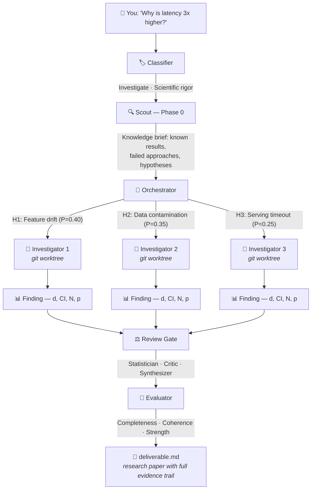
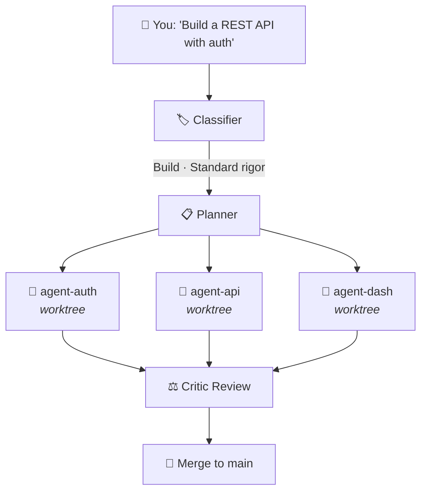
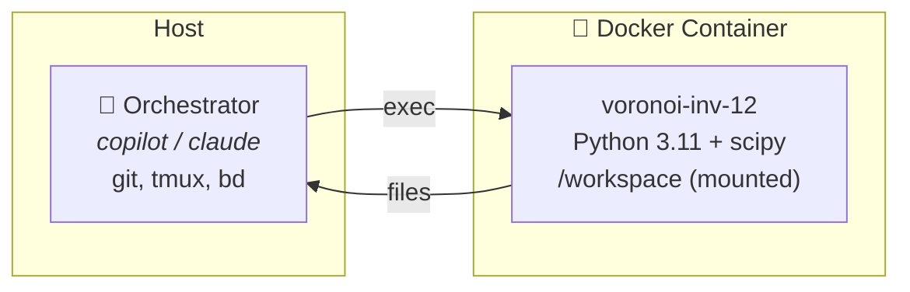
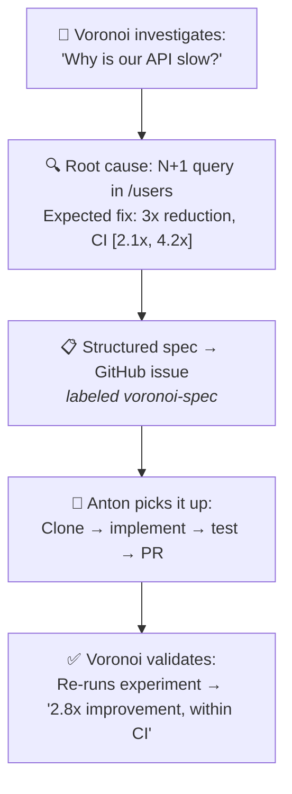

<div align="center">

# 🔬 Voronoi

### Science-first multi-agent orchestration

**Ask a question on Telegram. Get a research paper.**

<br/>

[](https://python.org)
[](https://github.com/features/copilot)
[](https://core.telegram.org/bots)
[](https://github.com/steveyegge/beads)
[](./LICENSE)

<br/>

<a href="#quickstart"><strong>Quickstart</strong></a>&nbsp;&nbsp;&middot;&nbsp;&nbsp;<a href="#how-it-works"><strong>How It Works</strong></a>&nbsp;&nbsp;&middot;&nbsp;&nbsp;<a href="#commands"><strong>Commands</strong></a>&nbsp;&nbsp;&middot;&nbsp;&nbsp;<a href="#telegram"><strong>Telegram</strong></a>&nbsp;&nbsp;&middot;&nbsp;&nbsp;<a href="#demos"><strong>Demos</strong></a>&nbsp;&nbsp;&middot;&nbsp;&nbsp;<a href="#comparison"><strong>Comparison</strong></a>&nbsp;&nbsp;&middot;&nbsp;&nbsp;<a href="DESIGN.md"><strong>Design</strong></a>

</div>

<br/>

> **Voronoi** orchestrates multiple AI agents in parallel — with hypothesis management, statistical rigor, convergence feedback loops, and evidence preservation. Engineering is science with the rigor gates turned off.

### Why "Voronoi"?

A [Voronoi diagram](https://en.wikipedia.org/wiki/Voronoi_diagram) partitions space into cells — each point belongs to exactly one region, with no overlaps and no gaps. That's what this framework does with problems: each agent owns a non-overlapping slice of the investigation, works in isolation, and the cells merge into a complete picture. The boundaries between cells are where the interesting science happens — just like in the math.

---

<br/>

## What Makes This Different

<table>
<tr>
<td width="33%">

**Science, Not Just Code**

Other agent frameworks build software. Voronoi runs **investigations** — with pre-registration, competing hypotheses, belief maps, and statistical validation. Findings come with effect sizes and confidence intervals, not just "it works."

</td>
<td width="33%">

**One Prompt, Zero Config**

Type `/swarm "Why is our model accuracy dropping?"` and walk away. The system auto-detects whether to **build**, **investigate**, **explore**, or **hybridize** — and selects the rigor level to match.

</td>
<td width="33%">

**Telegram-Native Science**

Text a question in your Telegram group. Voronoi classifies intent, dispatches agents, streams progress updates, and delivers findings — all from your pocket. Or use the CLI. Same engine either way.

</td>
</tr>
</table>

---

<h2 id="quickstart">Quickstart</h2>

### Option A: Server Mode (Telegram-first — recommended)

Set up once on a server. Text questions from your phone forever.

```bash
# 1. Install
pip install voronoi

# 2. Initialize the server (creates ~/.voronoi/)
voronoi server init

# 3. Set your credentials in ~/.voronoi/.env
cp ~/.voronoi/.env.example ~/.voronoi/.env
# Edit ~/.voronoi/.env — fill in:
#   GH_TOKEN=ghp_...                  (GitHub PAT for cloning/publishing)
#   VORONOI_TG_BOT_TOKEN=...          (from @BotFather)
#   VORONOI_TG_USER_ALLOWLIST=...     (optional: restrict to specific users)

# 4. Start the Telegram bridge
voronoi server start
```

Now open Telegram and text:

```
You:     Why is accuracy dropping in github.com/acme/ml-model?
Voronoi: 🔬 Investigation #1 queued. Cloning acme/ml-model...
         🔍 Scout analyzing 342 files... 3 hypotheses generated.
         ⚡ 3 investigators dispatched in parallel.
         [2 hours later]
         🧪 ROOT CAUSE: Training pipeline introduced 12% label noise.
         📄 Paper: github.com/voronoi-lab/acme-ml-accuracy-inv1

You:     Does EWC prevent catastrophic forgetting better than replay?
Voronoi: 🔬 Investigation #2 queued. Creating lab workspace...
         [4 hours later]
         📄 Paper + raw data: github.com/voronoi-lab/ewc-vs-replay-inv2

You:     What did we learn about forgetting?
Voronoi: 📚 3 findings from investigation #2:
         1. EWC+Replay hybrid: backward transfer 0.81 (REPLICATED)
         2. EWC alone: d=0.34 over replay, needs N>50k
         3. Naive sequential: catastrophic at task 3+
```

**That's it.** No SSH, no CLI, no `cd`. Just text a question and get a research paper.

### Option B: Local Mode (CLI-first)

Work directly inside a project on your machine.

```bash
pip install voronoi

cd my-project
voronoi init

# Start your AI coding agent
copilot                    # or: claude
> /swarm Build a full-stack SaaS app with auth, billing, dashboard, and API
```

The swarm plans the work, spawns isolated agents, and merges results back.

For science:

```bash
> /swarm Why is our recommendation model's CTR dropping 15% after each retrain?
```

Voronoi classifies this as **Investigate** (Scientific rigor), spawns a Scout, generates hypotheses, dispatches parallel Investigators, validates findings with a Statistician, and delivers a research report with evidence.

---

<h2 id="how-it-works">How It Works</h2>



For **engineering tasks**, the system simplifies automatically:



Same framework. Same commands. Rigor gates activate only when warranted.

---

<h2 id="commands">Commands</h2>

### From your AI agent (CLI)

| Command | What it does |
|---------|-------------|
| `/swarm <task>` | Classify intent → plan tasks → spawn parallel agents |
| `/standup` | Status report across all agents |
| `/progress` | Quick metric overview |
| `/spawn <id>` | Launch a single agent on a specific task |
| `/merge` | Merge completed agent branches |
| `/teardown` | Kill all agents, clean up worktrees |

<h3 id="telegram">From Telegram</h3>

| Command | What Happens |
|---------|-------------|
| `/voronoi investigate <question>` | Classify → hypothesize → parallel investigation → findings with evidence |
| `/voronoi explore <question>` | Generate options → benchmark → comparison matrix |
| `/voronoi build <description>` | Decompose → parallel build → critic review → merge |
| `/voronoi experiment <hypothesis>` | Pre-register → experiment → replicate → report (max rigor) |
| `/voronoi recall <query>` | Search past findings in knowledge store |
| `/voronoi belief` | Show current belief map with hypothesis probabilities |
| `/voronoi journal` | Recent investigation journal entries |
| `/voronoi finding <id>` | Detailed view of a specific finding |
| `/voronoi status` | Swarm status — open tasks, ready tasks |
| `/voronoi guide <msg>` | Send guidance to agents mid-flight |
| `/voronoi pivot <msg>` | Strategic direction change |
| Free-text in groups | Auto-detect scientific intent and dispatch |

Natural language works too — _"Why is our model accuracy dropping after each retrain?"_ — Voronoi detects the intent, classifies rigor level, and dispatches agents automatically.

---

## The Science Stack

What makes Voronoi unique — no other agent framework has this:

<table>
<tr>
<td width="50%">

### 🧪 11 Specialized Roles

| Role | When Active |
|------|------------|
| **Builder** 🔨 | Build tasks |
| **Scout** 🔍 | Before any investigation |
| **Investigator** 🔬 | Tests hypotheses |
| **Critic** ⚖️ | Before any merge |
| **Synthesizer** 🧩 | Integrates findings |
| **Evaluator** 🎯 | Scores deliverables |
| **Explorer** 🧭 | Compares options |
| **Theorist** 🧬 | Builds causal models |
| **Methodologist** 📐 | Reviews experiment design |
| **Statistician** 📊 | Reviews quantitative claims |
| **Worker** ⚙️ | General-purpose tasks |

Auto-selected by task type. Build mode uses 2 roles. Full investigation uses all 11.

</td>
<td width="50%">

### 🔒 Rigor Gates

| Gate | Standard | Analytical | Scientific | Experimental |
|------|:--------:|:----------:|:----------:|:------------:|
| Critic review | ✅ | ✅ | ✅ | ✅ |
| Statistician | — | ✅ | ✅ | ✅ |
| Final evaluation | — | ✅ | ✅ | ✅ |
| Methodologist | — | — | ✅ | ✅ |
| Pre-registration | — | — | ✅ | ✅ |
| Power analysis | — | — | ✅ | ✅ |
| Partial blinding | — | — | ✅ | ✅ |
| Adversarial review | — | — | ✅ | ✅ |
| Replication | — | — | — | ✅ |

Auto-classified. _"Build X"_ → Standard. _"Why X?"_ → Scientific. When in doubt, classify higher — gates can be skipped but not added retroactively.

</td>
</tr>
</table>

### Evidence System

Every finding is a first-class artifact with a complete evidence trail:

```
📊 FINDING bd-42: Redis outperforms Memcached for our workload
   Effect: d=2.3, CI [1.9, 2.8], N=10,000 requests
   Test: Welch t-test, p<0.001
   Robust: YES (3 parameter variations tested)
   Data: data/raw/cache_benchmark.csv (SHA-256: a3f2...)
   Replicated: 2/2 agree (overlapping 95% CIs)
```

| Layer | Location | Purpose |
|-------|----------|---------|
| **Findings** | Beads entries | Effect size, CI, N, stat test, data hash |
| **Raw Data** | `data/raw/` | CSV/JSON committed per experiment |
| **Journal** | `.swarm/journal.md` | Narrative continuity across cycles |
| **Belief Map** | `.swarm/belief-map.json` | Hypothesis probabilities, updated per cycle |
| **Strategic Context** | `.swarm/strategic-context.md` | Dead ends, gaps, decision rationale |
| **Deliverable** | `.swarm/deliverable.md` | Final output scored by Evaluator |

---

## Architecture

```
voronoi/
├── src/voronoi/
│   ├── cli.py                  # CLI: init, upgrade, demo, server
│   ├── gateway/                # Telegram science interface
│   │   ├── intent.py           # Free-text → workflow mode + rigor classifier
│   │   ├── memory.py           # Per-chat conversation memory (SQLite)
│   │   ├── knowledge.py        # Knowledge store queries (findings, beliefs)
│   │   ├── progress.py         # Real-time OODA progress relay
│   │   └── handoff.py          # Voronoi → Anton/MVCHA handoff protocol
│   └── server/                 # Server mode infrastructure
│       ├── repo_url.py         # GitHub URL extraction from free text
│       ├── workspace.py        # Auto-clone with --reference, lab creation
│       ├── queue.py            # Investigation queue (SQLite, concurrency control)
│       ├── runner.py           # Queue runner, server config
│       ├── sandbox.py          # Docker sandbox per investigation
│       └── publisher.py        # Push results to GitHub (voronoi-lab/ org)
│
├── scripts/                    # Infrastructure plumbing
│   ├── swarm-init.sh           # One-time project setup
│   ├── spawn-agent.sh          # Git worktree + tmux, launch agent
│   ├── merge-agent.sh          # Merge branch → main, clean up
│   ├── teardown.sh             # Kill sessions, prune worktrees
│   ├── sandbox-exec.sh         # Run commands in Docker sandbox (fallback to host)
│   ├── notify-telegram.sh      # Outbound Telegram notifications
│   ├── telegram-bridge.py      # Inbound Telegram command bridge
│   └── dashboard.py            # Live terminal monitoring (Rich)
│
├── docker/
│   └── voronoi-python.Dockerfile  # Python 3.11 + scipy + matplotlib + git
│
├── .github/
│   ├── agents/                 # Specialized agent personas
│   ├── prompts/                # Slash command definitions
│   └── skills/                 # Reusable domain knowledge
│
├── demos/                      # 3 proof-of-concept scenarios
└── DESIGN.md                   # Full design philosophy
```

### Server Mode Layout

```
~/.voronoi/                          # created by: voronoi server init
├── config.json                      # server settings
├── knowledge.db                     # ALL findings across ALL investigations
├── conversations.db                 # Telegram chat history
├── queue.db                         # investigation queue
│
├── objects/                         # shared git object store
│   ├── acme--ml-model.git           # bare clone (reused across investigations)
│   └── acme--api.git
│
└── active/                          # one workspace per running investigation
    ├── inv-1-acme-ml-accuracy/      # repo-bound (cloned with --reference)
    │   ├── .swarm/                  # science state, journal, beliefs
    │   ├── .sandbox-id              # Docker container ID
    │   └── (repo files)
    └── inv-2-ewc-vs-replay/         # pure science (git init from scratch)
        ├── .swarm/
        ├── PROMPT.md                # the original question
        ├── src/                     # generated experiment code
        └── data/raw/                # committed experimental data
```

**Everything is local files.** Agents are coordinated through git branches, [Beads](https://github.com/steveyegge/beads) for task tracking, and tmux sessions. Code execution is sandboxed in Docker.

---

<h2 id="demos">Demos</h2>

```bash
voronoi demo list                          # see available demos
voronoi demo run coupled-decisions         # launch a demo
voronoi demo run forgetting-cure --safe    # restrict agent tools
voronoi demo run emergent-ecosystem --dry-run  # copy files only
```

<table>
<tr>
<td width="33%">

**[Coupled Decisions](demos/coupled-decisions/)**

Multi-agent reasoning over 5 coupled commercial levers. Planted ground truth across 100K+ synthetic transactions. Can the swarm discover what humans can't see in raw data?

</td>
<td width="33%">

**[Emergent Ecosystem](demos/emergent-ecosystem/)**

100×100 grid, 4 species, 4 communication strategies. Each agent builds one species module in isolation. Watch highways, flocks, and extinction cascades emerge.

</td>
<td width="33%">

**[Forgetting Cure](demos/forgetting-cure/)**

4 brain-inspired anti-forgetting strategies implemented from scratch (no PyTorch). Head-to-head MNIST benchmark, then discover the optimal hybrid. Pure numpy-free backprop.

</td>
</tr>
</table>

---

<h2 id="comparison">How Voronoi Compares</h2>

| Capability | **Voronoi** | CrewAI | AutoGen | MetaGPT |
|:-----------|:----------:|:------:|:-------:|:-------:|
| Parallel agents in git worktrees | ✅ | — | — | — |
| Hypothesis management & belief maps | ✅ | — | — | — |
| Statistical rigor gates (CI, p-values) | ✅ | — | — | — |
| Pre-registration & replication | ✅ | — | — | — |
| Evidence system (raw data + SHA-256) | ✅ | — | — | — |
| Auto intent classification | ✅ | — | ✅ | ✅ |
| Telegram-native interface | ✅ | — | — | — |
| Docker-sandboxed execution | ✅ | — | ✅ | — |
| Role-based agent specialization | ✅ (11 roles) | ✅ | ✅ | ✅ (6 roles) |
| Task dependency tracking | ✅ (Beads) | — | — | ✅ |
| Deliverable scoring (Evaluator) | ✅ | — | — | — |
| Works with any LLM agent | ✅ | ✅ | ✅ | — |

Other frameworks orchestrate **code generation**. Voronoi orchestrates **investigations** — where the output is evidence, not just software.

---

## Sample Output

What a finding actually looks like after the review gates:

```
╔══════════════════════════════════════════════════════════════════════╗
║  FINDING bd-127: Sleep Replay + EWC hybrid outperforms all         ║
║  individual anti-forgetting strategies                             ║
╠══════════════════════════════════════════════════════════════════════╣
║                                                                    ║
║  Hypothesis:  H3 — Combining complementary mechanisms preserves    ║
║               more knowledge than any single approach              ║
║  Verdict:     ✅ SUPPORTED                                         ║
║                                                                    ║
║  Effect:      d = 1.47, 95% CI [1.12, 1.83]                       ║
║  Baseline:    Naive sequential — 12% Task 1 accuracy at Task 5    ║
║  Treatment:   Sleep Replay + EWC hybrid — 89% accuracy retained    ║
║  N:           5 sequential MNIST tasks × 3 seeds                   ║
║  Test:        Welch t-test, p < 0.001                              ║
║                                                                    ║
║  Robust:      YES — tested with λ ∈ {0.1, 1.0, 10.0},             ║
║               replay ratios ∈ {10%, 25%, 50%}                      ║
║  Data:        data/raw/forgetting_benchmark.csv                    ║
║  Hash:        sha256:e7b3f...                                      ║
║  Replicated:  2/2 seeds agree (overlapping 95% CIs)                ║
║                                                                    ║
║  REVIEWED BY: Statistician ✅ · Critic ✅ · Methodologist ✅        ║
╚══════════════════════════════════════════════════════════════════════╝
```

This isn't a mock-up — it's the format every Voronoi finding ships in. Effect sizes, not vibes.

---

## Telegram Setup

```bash
# 1. Get a bot token from @BotFather on Telegram
# 2. Set credentials in ~/.voronoi/.env:
#    VORONOI_TG_BOT_TOKEN=your-bot-token
#    VORONOI_TG_USER_ALLOWLIST=your_username    # optional: restrict access

# 3. Disable privacy mode (for free-text in groups):
#    @BotFather → /setprivacy → Disable

# 4. Start the bridge:
voronoi server start
```

Credentials can also be set via environment variables or in a project `.env`.

In groups, the bot only responds when **@mentioned** or **replied to** — no spam.

Free-text intent detection works in group chats — just ask a question, no `/voronoi` prefix needed.

---

## Docker Sandbox

Agent code execution runs in Docker containers — isolated, resource-limited, reproducible.

```bash
# Build the science image (one time)
docker build -t voronoi-python:latest -f docker/voronoi-python.Dockerfile .

# Or pull pre-built:
docker pull python:3.11-slim   # minimal fallback
```

The **orchestrator runs on the host** (needs git, tmux, Beads). The **experiments run in Docker** (safe, capped at 4 CPUs / 8 GB RAM / 12 hour timeout).



If Docker is unavailable, Voronoi falls back to host execution automatically.

Configure in `~/.voronoi/config.json`:

```json
{
  "sandbox": {
    "enabled": true,
    "image": "voronoi-python:latest",
    "cpus": 4,
    "memory": "8g",
    "timeout_hours": 12,
    "network": true,
    "fallback_to_host": true
  }
}
```

---

## Server Management

```bash
voronoi server init              # Create ~/.voronoi/, write config
voronoi server status            # Running/queued investigations, workspace count
voronoi server config            # Show current config
voronoi server prune --force     # Clean completed workspaces
```

---

## Voronoi + Anton (MVCHA)

Voronoi is the **science brain**. [Anton (MVCHA)](https://github.com/shyamsridhar123/MVCHA) is the **engineering hands**.



They can coexist in the same Telegram group — Voronoi handles _"why"_ questions, Anton handles _"fix"_ commands.

---

## Prerequisites

- **Python 3.10+**
- **[Beads (bd)](https://github.com/steveyegge/beads)** — dependency-aware task tracking
- **[tmux](https://github.com/tmux/tmux)** — terminal multiplexer for agent sessions
- **[GitHub CLI (gh)](https://cli.github.com/)** — optional, for GitHub integration
- **[Copilot CLI](https://githubnext.com/projects/copilot-cli/)** — AI coding agent (or Claude CLI)

```bash
# macOS
brew install beads tmux gh
```

## Configuration

After `voronoi init`, `.swarm-config.json` is generated:

```json
{
  "max_agents": 4,
  "agent_command": "copilot",
  "agent_flags": "--allow-all",
  "notifications": {
    "telegram": {
      "bot_token": "...",
      "chat_id": "...",
      "bridge_enabled": true,
      "free_text_in_groups": true
    }
  }
}
```

## Upgrade

```bash
pip install --upgrade voronoi
cd my-project
voronoi upgrade    # Replaces scripts/ and .github/ — your CLAUDE.md is preserved
```

---

## Contributing

```bash
git clone https://github.com/Vahidrostami/voronoi
cd voronoi
pip install -e .
pytest              # 218 tests
```

Voronoi uses [Beads](https://github.com/steveyegge/beads) for issue tracking:

```bash
bd onboard          # Get started
bd ready            # Find available work
```

## Design

See [DESIGN.md](DESIGN.md) for architecture, workflow modes, rigor levels, evidence layers, and convergence criteria.

---

## Star History

<a href="https://star-history.com/#Vahidrostami/voronoi&Date">
 <picture>
   <source media="(prefers-color-scheme: dark)" srcset="https://api.star-history.com/svg?repos=Vahidrostami/voronoi&type=Date&theme=dark" />
   <source media="(prefers-color-scheme: light)" srcset="https://api.star-history.com/svg?repos=Vahidrostami/voronoi&type=Date" />
   
 </picture>
</a>

---

<div align="center">
  <sub>MIT License</sub>
  <br/>
  <sub><em>Voronoi — ask a question, get evidence.</em></sub>
</div>
